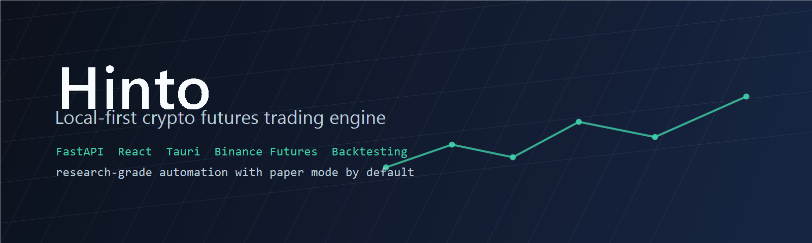
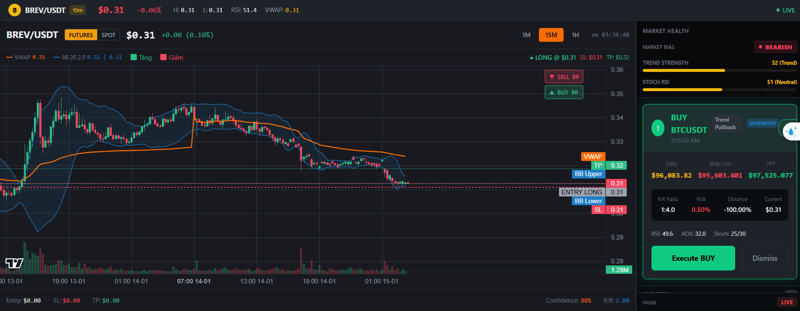
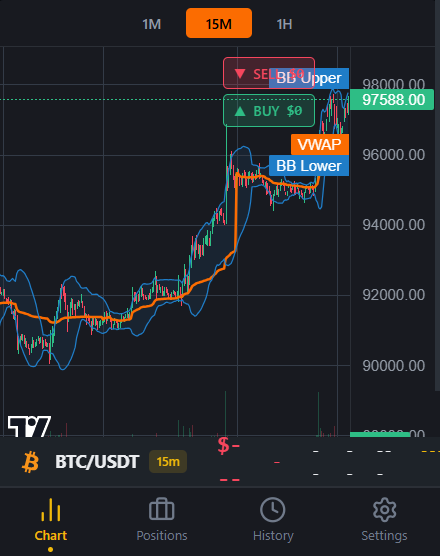
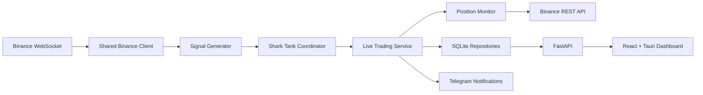

<p align="center">
  
</p>

<p align="center">
  <strong>Local-first crypto futures trading engine with backtesting, paper mode, live monitoring, and a Tauri desktop dashboard.</strong>
</p>

<p align="center">
  <a href="#features">Features</a> |
  <a href="#screenshots">Screenshots</a> |
  <a href="#architecture">Architecture</a> |
  <a href="#quick-start">Quick Start</a> |
  <a href="#safety">Safety</a> |
  <a href="#strategy-direction">Strategy Direction</a> |
  <a href="#contributing">Contributing</a>
</p>

<p align="center">
  
  
  
  
  
  
</p>

---

## Overview

**Hinto** is a research-grade trading system for Binance Futures. It keeps the
core trading logic local, tracks signals away from the exchange, and executes
only when a tracked signal is triggered. The project includes:

- A FastAPI backend for market data, signal generation, execution, settings,
  analytics, and WebSocket updates.
- A React + Tauri dashboard for monitoring signals, positions, backtests, and
  live state.
- A backtesting engine tuned for closer live parity with 1m monitoring,
  candle-close stop validation, and realistic execution assumptions.
- Guardrails for paper/testnet-first operation, secret handling, and public
  release hygiene.

Hinto is open-sourced as a codebase and research platform. It is not financial
advice, a profit guarantee, or a plug-and-play money machine.

## Features

| Area | What Hinto Provides |
| --- | --- |
| Local-first execution | Signals are stored locally and only become orders when price triggers. |
| Strategy engine | Liquidity-zone style signal generation, confluence scoring, delta divergence, and multi-timeframe trend filters. |
| Risk controls | Candle-close stop loss, hard-cap protection, exchange backup stops, global drawdown halt, and dead-zone windows. |
| Backtesting | Historical simulation with 1m monitoring, configurable leverage, max positions, stop logic, and execution mode. |
| Dashboard | React/Tauri interface for charts, portfolio state, signal logs, settings, and backtest views. |
| Persistence | SQLite repositories for signals, orders, positions, settings, and analytics. |
| Notifications | Telegram notification support for system and trade events. |
| Public safety | `.env.example` templates, tracked-file secret scanning, ignored local secrets, and paper mode defaults. |

## Screenshots

<p align="center">
  
</p>

<p align="center">
  
</p>

## Architecture



The backend follows a layered structure:

| Layer | Path | Responsibility |
| --- | --- | --- |
| API | `backend/src/api` | HTTP/WebSocket endpoints and request schemas. |
| Application | `backend/src/application` | Trading, backtesting, signal, risk, and orchestration services. |
| Domain | `backend/src/domain` | Entities, interfaces, value objects, and repository contracts. |
| Infrastructure | `backend/src/infrastructure` | Binance clients, persistence, indicators, notifications, execution queues. |
| Frontend | `frontend/src` | Desktop dashboard, charts, settings, and monitoring views. |

## Quick Start

Clone and configure:

```powershell
git clone https://github.com/meiiie/hinto-trader.git
cd hinto-trader
Copy-Item .env.example .env
```

The default `.env.example` uses `ENV=paper` with `HINTO_PAPER_REAL=true`.
This keeps live Binance market data and a live-like dashboard while orders and
fills stay in the local simulator. Keep this mode while validating strategy
behavior; see `docs/PAPER_REAL_MODE.md`.

Run the backend:

```powershell
cd backend
python -m venv .venv
.\.venv\Scripts\Activate.ps1
pip install -r requirements.txt
python run_backend.py
```

Run the dashboard:

```powershell
cd frontend
npm ci
npm run dev
```

Build the dashboard:

```powershell
cd frontend
npm run build
```

Run the tracked-file secret scan:

```powershell
powershell -NoProfile -ExecutionPolicy Bypass -File .\scripts\secret-scan.ps1
```

## Configuration

Hinto reads runtime configuration from environment files and local settings.
Never commit real credentials.

| File | Purpose |
| --- | --- |
| `.env.example` | Root template for paper/testnet/live settings. |
| `backend/.env.example` | Backend-specific Binance/testnet template. |
| `frontend/.env.example` | Dashboard API/WebSocket endpoint template. |
| `SECURITY.md` | Secret-handling and reporting guidance. |

## Safety

Trading software can lose money quickly, especially with leverage. Treat Hinto
as research infrastructure unless you have audited the code, the configuration,
and the exchange behavior yourself.

- Start with `ENV=paper`.
- Use Binance testnet before live credentials.
- Rotate any key that has ever been copied into a repository, chat, screenshot,
  or log.
- Do not commit `.env`, `.env.production`, PEM files, databases, generated CSVs,
  or local logs.
- Run `scripts/secret-scan.ps1` before every public release.

## Strategy Direction

Hinto is being developed as a research platform before it is treated as a live
trading system. The current mean-reversion scalper is now a benchmark track, not
a final answer. The next research track focuses on positive-skew continuation:
small controlled losses, larger trailed winners, and validation by R-multiple
distribution rather than headline win rate.

See `docs/STRATEGY_ROADMAP.md` for promotion/kill criteria, broker expansion
rules, and the clean-architecture path for adding new strategies.

## Repository Status

This public repository starts from a cleaned source snapshot. Private deployment
history, local logs, old agent folders, generated build outputs, and archived
research scratch files were intentionally left out.

## Contributing

Contributions are welcome. Please read `CONTRIBUTING.md` before opening an
issue or pull request.

Good first areas:

- Safer defaults and clearer configuration validation.
- Backtest/live parity tests.
- Dashboard usability and accessibility.
- Documentation for paper/testnet workflows.
- Exchange adapter abstractions.

## License

MIT License. See `LICENSE`.
